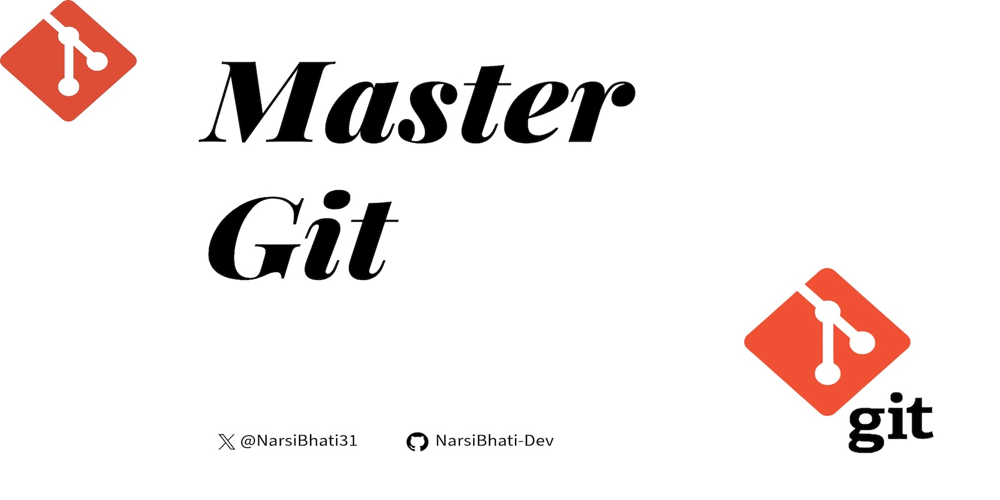

# Mastering Git: A Beginner's Guide to Version Control



## Introduction

Version control is an essential skill for developers, and **Git** is one of the most powerful tools available. Whether you're working solo or collaborating with a team, Git helps track changes, manage code versions, and streamline workflows. In this guide, we'll explore Git from the ground up, covering installation, basic commands, and best practices.

---

## Why Learn Git?

**Git** is a **distributed version control system** that allows you to:

✅ Track changes to your code over time.

✅ Collaborate with other developers efficiently.

✅ Work on different features simultaneously using branches.

✅ Revert to previous versions if something goes wrong.

✅ Manage project history with structured commit messages.

Mastering Git will help you **become a more productive and efficient developer**. Let's get started!

---

## 📌 Installing Git

Before using Git, you need to install it on your system.

### Windows / Linux (Ubuntu)

```bash
sudo apt install git-all
```

### MacOS

```bash
brew install git
```

After installation, verify your Git version:

```bash
git --version
```

If everything is set up correctly, you should see the installed version number.

---

## 📌 Configuring Git

Before using Git, set up your user identity:

```bash
git config --global user.name "Your Name"
git config --global user.email "your.email@example.com"
```

To check your configuration:

```bash
git config --list
```

Set a default branch:

```bash
git config --global init.defaultBranch main
```

Now your Git environment is ready to go!

---

## 📌 Getting Started with Git Commands

### 1️⃣ Cloning a Repository

To create a local copy of a remote repository:

```bash
git clone <repository-url>
```

**Example:**

```bash
git clone https://github.com/user/repository.git
```

### 2️⃣ Checking the Status of Files

To see which files have been modified, added, or deleted:

```bash
git status
```

### 3️⃣ Adding Changes to Staging

Before committing, you need to stage your changes:

```bash
git add <filename>
```

To add all changes at once:

```bash
git add .
```

### 4️⃣ Committing Changes

After staging files, commit them with a descriptive message:

```bash
git commit -m "Your commit message here"
```

### 5️⃣ Pushing Changes to a Remote Repository

Once committed, push your changes to GitHub/GitLab:

```bash
git push origin main
```

For a different branch:

```bash
git push -u origin <branch-name>
```

### 6️⃣ Pulling Changes from Remote Repository

To sync your local branch with the latest remote changes:

```bash
git pull origin <branch-name>
```

### 7️⃣ Working with Branches

**Check available branches:**

```bash
git branch
```

**Create a new branch:**

```bash
git checkout -b new-feature
```

**Switch to another branch:**

```bash
git checkout <branch-name>
```

**Delete a branch:**

```bash
git branch -d <branch-name>
```

### 8️⃣ Viewing Commit History

To see past commits:

```bash
git log --oneline
```

To view the commit differences:

```bash
git diff
```

### 9️⃣ Undoing Changes

Reset to a previous commit without deleting changes:

```bash
git reset --mixed <commit-hash>
```

Undo the last commit but keep changes staged:

```bash
git reset --soft HEAD~1
```

To completely remove changes after a commit:

```bash
git reset --hard <commit-hash>
```

---

## 📌 Merging and Handling Merge Conflicts

### **Merging Branches**

To merge a branch into the current branch:

```bash
git merge <branch-name>
```

If conflicts arise:

1. Identify conflicting files using:

   ```bash
       git status
   ```

2. Manually edit the conflicted files.
3. Stage the resolved files:

   ```bash
       git add <filename>
   ```

4. Complete the merge:

   ```bash
     git commit -m "Resolved merge conflict"
   ```

If you want to **abort the merge**:

```bash
git merge --abort
```

---

## 📌 Writing Better Commit Messages

To maintain clean commit history, follow these best practices:

✅ Use the **imperative mood** (e.g., "Fix bug" instead of "Fixed bug").
✅ Keep the subject line **under 50 characters**.
✅ Provide detailed explanations when necessary.

**Example of a good commit message:**

```bash
git commit -m "Refactor user authentication module to improve security"
```

---

## 📌 Creating and Managing Pull Requests (PRs)

A **pull request (PR)** allows you to propose changes before merging them into the main branch.

### **Steps to Create a PR:**

1️⃣ Push your feature branch to GitHub:

```bash
git push origin feature-branch
```

2️⃣ Go to **GitHub/GitLab/Bitbucket** and create a **Pull Request (PR)**.
3️⃣ Add a descriptive title and explanation.
4️⃣ Request reviews from team members.
5️⃣ Address feedback and make necessary changes.
6️⃣ Merge the PR once approved.

---

## 📌 Handling Issues and Merge Conflicts

**Tracking Issues:**

- Use GitHub Issues to track bugs and features.
- Assign labels and milestones for better organization.

**Fixing Merge Conflicts:**

1. Identify conflicting files.
2. Manually edit conflicts.
3. Stage, commit, and push the resolved changes.

By following these best practices, you can efficiently collaborate with your team and maintain a structured workflow.

---

## 🎯 Conclusion

Mastering Git is a crucial skill for any developer. By understanding its core concepts and practicing these commands, you'll be able to **manage projects more effectively, collaborate seamlessly, and maintain a clean codebase**.

🚀 **Start using Git today and take control of your development workflow!** 🚀

---

If you found this guide helpful, leave a ⭐ on the repository and share it with fellow developers!

Happy Coding! 😊
